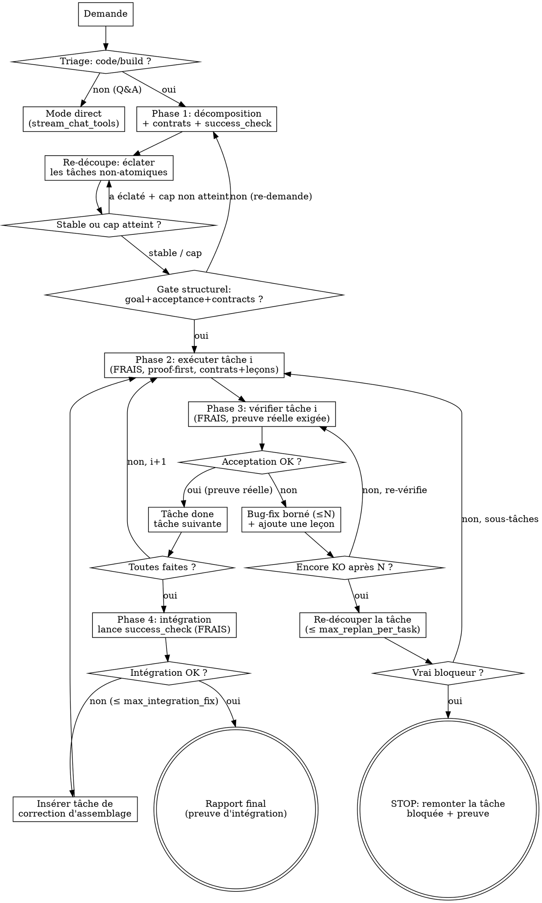

# Harnais de réflexion (découpage forcé) — Design

> Spec Loom. Transpose la méthodologie superpowers (brainstorm → plan → subagent-driven)
> au modèle local 4B : un rail déterministe force la décomposition d'une demande de code
> en **tâches atomiques**, exécute chacune en **contexte frais**, et **vérifie** chacune
> avant d'avancer. But : empêcher les erreurs de se composer pour pousser le taux d'échec
> vers ~0.

## Problème

Constat live (cf. mémoires `loom-run-reel-playlist`, `loom-choix-modele`) : aucun petit
modèle (Gemma E4B, Qwen3.5-4B) ne sait construire un démineur ni débugger correctement
**d'un seul tenant**. En revanche ils réussissent une tâche **petite et bien cadrée**. Le
mode d'échec dominant n'est pas l'incapacité mais :

1. la perte du fil sur une tâche multi-étapes (contexte qui se pollue) ;
2. les erreurs qui **se composent** — on construit l'étape N+1 sur une étape N cassée ;
3. l'absence de preuve : le modèle affirme « ça marche » sans vérifier.

Loom a déjà les outils (`dispatch_agent`, `manage_todos`, `format_code`, `check_page`,
`run_shell`) et les garde-fous de boucle (`stream_chat_tools`). Ce qui manque, c'est le
**harnais qui force le découpage et la vérification** — la partie « réflexion » que
superpowers encode en gates, pas en prose.

## Principe directeur : déterminisme du PROCESS, jamais du CONTENU

Frontière non négociable (cf. mémoires `loom-lecon-harness-deterministe`,
`loom-philosophie-auto-amelioration`, `loom-reset-tooling-pur`) :

- **Le code (le rail) décide la SÉQUENCE et l'ISOLATION** : forcer une décomposition avant
  tout code, exécuter chaque tâche en contexte frais, exiger une preuve avant d'avancer,
  borner les reprises, stopper proprement sur blocage.
- **Le modèle décide tout le CONTENU** : la reformulation, les morceaux, les tâches, les
  critères d'acceptation, le code, le fix, et le verdict succès/échec (ancré dans une
  sortie réelle).

L'orchestrateur ne décide JAMAIS ce qu'est une tâche ni si un code est « bon » : il lance
la preuve déclarée et enforce l'enchaînement. C'est le déterminisme-qui-VÉRIFIE (autorisé),
pas le déterminisme-qui-DÉCIDE (proscrit).

## Architecture

Nouveau module `loom/reflect.py` exposant un orchestrateur générateur :

```
run_reflective(client, messages, system_prompt, *, registry_factory, conversation,
               model, max_tokens, permission, ...) -> Iterator[(kind, payload)]
```

Il **yield les mêmes tuples d'events** que `stream_chat_tools`
(`reasoning|content|tool_call|tool_result|tool_stream|tool_request`), plus des events de
phase (`phase`, voir plus bas). La web app le streame **à l'identique** : aucune nouvelle
plomberie de transport. Chaque sous-agent est affiché dans sa pastille comme
`dispatch_agent` aujourd'hui.

Le rail **réutilise** sans les modifier :
- `dispatch_agent` (mécanisme de sous-boucle à contexte frais) pour l'exécution et la
  vérification par tâche ;
- la `Conversation` de la session pour stocker le plan structuré (nouveau champ
  `conversation.plan`, persisté dans session.json comme `todos`) ;
- les outils communs/agnostiques (zéro changement, zéro outil par-modèle).

### Le plan structuré

Le plan est une liste de tâches, plus riche que `manage_todos` (qui reste l'outil de
bloc-notes du mode direct, inchangé) :

```python
@dataclass
class Task:
    id: int                 # ordre stable
    goal: str               # objectif atomique (UNE chose)
    files: list[str]        # fichiers que la tâche touche (contexte du sous-agent)
    acceptance: str         # critère CONCRET et EXÉCUTABLE de "fini"
    depends_on: list[int]   # ids des tâches dont celle-ci suppose le résultat
    status: str             # pending | in_progress | done | blocked
    evidence: str = ""      # sortie réelle de la dernière vérification

@dataclass
class Plan:
    goal: str               # reformulation de l'objectif d'origine (= critère final)
    success_check: str      # comment PROUVER l'objectif d'origine de bout en bout
    contracts: list[str]    # contrats partagés gelés : signatures, noms, formes, layout
    tasks: list[Task]
    lessons: list[str]      # leçons accumulées (échec->fix) injectées aux tâches suivantes
```

`acceptance` doit être une **preuve runnable** : une commande `run_shell`, une assertion
`check_page` (« 0 erreur console, 81 cellules »), `py_compiles`, ou un observable précis et
vérifiable. Une acceptation vague (« le code est propre ») est refusée au gate.

`success_check` est le critère de l'utilisateur (« jouable à la souris »), traduit en
preuve vérifiable — il pilote la **phase d'intégration finale** (Phase 4). `contracts`
gèle les interfaces partagées pour que des tâches exécutées en contexte frais **s'intègrent**
malgré leur isolation. `depends_on` impose un ordre **dépendance-aware**. `lessons` porte
l'**auto-amélioration** intra-run (cf. mémoire `loom-philosophie-auto-amelioration`).

### Le flux : triage → décompose+contrats → (re-découpe)* → (exécute proof-first → vérifie → fixe / re-découpe)* → intégration



## Phase 0 — Triage (routage, pas décision de contenu)

Le mode réflexion est **toujours actif pour le code** : à l'entrée, un tour de
classification léger décide la VOIE (pas le contenu). Le modèle répond à une consigne
binaire : la demande exige-t-elle de **créer/modifier du code ou un travail multi-étapes**,
ou est-ce une **demande directe** (résumé, lecture, recherche, réponse) ?

- Direct → on délègue à `stream_chat_tools` (mode actuel) inchangé.
- Build/multi-étapes → on entre dans le rail.

Le triage ROUTE ; il ne décide pas QUOI faire. Pour rester robuste, le défaut en cas
d'ambiguïté est **le rail** (mieux vaut sur-découper une tâche moyenne que de bâcler un
build). Le triage est un seul tour, peu coûteux.

## Phase 1 — Décomposition en entonnoir

Pilotée par un prompt dédié (`loom/prompts/reflect.decompose.md`). Le modèle produit, du
global vers le minuscule :

1. **global** : reformule l'objectif en 1-2 phrases + définit `success_check` (comment on
   PROUVERA l'objectif d'origine de bout en bout) + liste les gros morceaux.
2. **contrats** : gèle les **interfaces partagées** que toutes les tâches devront respecter
   — noms et signatures de fonctions, fichiers et leur rôle, formes de données, IDs/DOM
   pour le web. C'est l'antidote à la dérive d'interface (voir ci-dessous).
3. **moyen** : casse chaque morceau en sous-étapes.
4. **court** : casse les sous-étapes en **tâches atomiques** — une tâche = UNE chose
   (une fonction, un fix, une section), avec un `acceptance` concret et exécutable et ses
   `depends_on` (tâches dont elle suppose le résultat).

Sortie : le plan structuré (`Plan` : goal, success_check, contracts, tasks). Le modèle
l'émet via un appel d'outil dédié au rail (`submit_plan`, voir « Outils internes ») pour
qu'on récupère du JSON validé plutôt que du texte à parser.

### Contrats partagés : l'antidote à la dérive d'interface

Risque majeur du découpage en contextes frais : la tâche A définit `revealCell()`, la tâche
B (qui ne voit pas A) appelle `openCell()` — chaque tâche passe sa vérif isolée, mais
**l'ensemble ne compile/ne tourne pas**. Les erreurs réapparaissent à l'intégration.

Parade : les `contracts` gelés à la Phase 1 sont **injectés dans le prompt de CHAQUE
sous-agent** (exécution, fix, vérification). Un sous-agent doit s'y conformer à la lettre ;
s'il a besoin d'un contrat absent, il ne l'invente pas — sa tâche est marquée `blocked` avec
ce manque comme `evidence`, ce qui déclenche une re-décomposition (Phase 3) qui ajoutera le
contrat manquant. Les contrats sont la mémoire partagée minimale qui rend l'isolation sûre.

### Re-découpage en boucle jusqu'à stabilité (le levier « plein de petites tâches »)

Après la 1re décomposition, on lance une **passe de re-découpage** : un sous-agent frais
dont le SEUL job est « parcours ce plan et éclate toute tâche non-atomique en plusieurs
tâches plus petites ; laisse intactes celles déjà atomiques ». On répète tant qu'une passe
**a effectivement éclaté** au moins une tâche.

Garde-fous (pas de fragmentation infinie ni de runaway) :
- **cap de passes** : `max_split_passes` (défaut 4) ;
- **cap de tâches** : `max_tasks` (défaut 30, aligné sur `manage_todos`) ; au-delà, on
  arrête de découper.
- Quand un cap est atteint alors qu'une passe voulait encore éclater, on **émet un `log`**
  visible (« re-découpage stoppé au cap de N passes / M tâches ») — jamais de cap
  silencieux qui ferait croire à une atomicité atteinte.

### Gate structurel (dur)

On ne passe à l'exécution que si le plan vérifie, de façon déterministe :
- ≥ 1 tâche ;
- chaque tâche a un `goal` non vide ;
- chaque tâche a une `acceptance` non vide ET qui ressemble à une preuve exécutable
  (heuristique simple : contient une commande, un nom de fichier, un nombre attendu, ou un
  mot-clé d'outil `run_shell`/`check_page`/`pytest`/`compile` — sinon on redemande au
  modèle de rendre l'acceptation vérifiable).

Échec du gate → on renvoie au modèle un message actionnable (« tâche k sans critère
vérifiable : donne une commande/observable ») et on reprend la décomposition (borné par
`max_decompose_retries`, défaut 2).

## Phase 2 — Exécution tâche par tâche, contexte FRAIS

Le rail parcourt les tâches dans l'ordre des dépendances (`depends_on` puis `id`). Pour la
tâche courante :
- statut `in_progress` ;
- on dispatche un **sous-agent neuf** (sous-boucle `stream_chat_tools` via le mécanisme de
  `dispatch_agent`, contexte vierge) avec un prompt **autonome** assemblé par le rail :
  - l'objectif de CETTE tâche uniquement ;
  - les **contrats partagés** (signatures/noms/formes à respecter à la lettre) ;
  - les **leçons** accumulées jusqu'ici (cf. Phase 3) — pièges déjà rencontrés à éviter ;
  - les `files` concernés (chemins absolus), avec consigne de **lire leur état COURANT
    d'abord** (les tâches précédentes les ont modifiés) — ne pas supposer le contenu ;
  - le critère `acceptance` ;
  - la consigne dure **proof-first** : « 1) lance d'abord ton critère d'acceptation et
    CONSTATE qu'il échoue ; 2) écris le code minimal pour le satisfaire + `format_code` ;
    3) relance le critère et CONSTATE qu'il passe. Fais SEULEMENT cette tâche, ne touche à
    rien d'autre. »

Le **proof-first** ancre la correction dans une preuve observée plutôt que dans l'intuition
du modèle — c'est le plus fort réducteur d'erreur (compatible « pas de suite de tests » : le
critère est une commande/observable, pas une suite pytest). Le contexte frais reste le
remède au mode d'échec n°1 (pollution du contexte) : le sous-agent ne voit ni les autres
tâches ni l'historique, juste son micro-objectif, les contrats et les leçons.

## Phase 3 — Vérification + bug-fix par tâche (regard neuf)

Après l'exécution, un **vérificateur frais et séparé** (autre sous-agent) reçoit le critère
`acceptance` et la consigne « lance CETTE preuve et rapporte le verdict + la sortie réelle ;
tu n'as pas écrit ce code, ne le juge pas de confiance ». Il renvoie un verdict structuré
(`{ok: bool, evidence: str}`) via un outil interne (`report_verdict`).

**Le verdict ne peut pas être bluffé.** On réutilise l'audit anti-confabulation existant de
`stream_chat_tools` : un `ok: true` n'est accepté QUE si une exécution réelle a eu lieu dans
la boucle du vérificateur (un `run_shell`/`check_page` a tourné ce run) et que `evidence`
porte une sortie réelle. Un « ça marche » sans preuve outillée est rejeté et traité comme
`not ok`. C'est indispensable : le vérificateur est le même 4B, il faut l'empêcher de se
déclarer vert tout seul.

- `ok` → tâche `done`, `evidence` stockée, tâche suivante.
- `not ok` → **boucle de fix bornée** (`max_fix_attempts`, défaut 3) : un sous-agent de fix
  reçoit l'objectif + l'`evidence` d'échec (sortie réelle) + les contrats + les fichiers,
  corrige, puis on **re-vérifie** (nouveau vérificateur frais). Chaque cycle échec→fix
  réussi ajoute une **leçon** au `Plan.lessons` (« sur tâche k : `data-c` cassait le HTML,
  corrigé en … ») injectée aux tâches suivantes — auto-amélioration intra-run.
- Toujours `not ok` après `max_fix_attempts` → la tâche n'était probablement **pas assez
  atomique**. Conformément à l'objectif (« plein de toutes petites tâches »), on tente
  d'abord de **re-découper CETTE tâche** en sous-tâches plus petites (un sous-agent éclate
  l'objectif + insère un contrat manquant si l'`evidence` le révèle), bornée par
  `max_replan_per_task` (défaut 1). Les sous-tâches remplacent la tâche dans le plan et
  repassent par exécution/vérification.
- Si même re-découpée la tâche reste `not ok` (vrai bloqueur : dépendance externe absente,
  ambiguïté que seul l'utilisateur tranche) → tâche `blocked`, **on STOPPE le rail** et on
  remonte : quelle tâche, son objectif, la dernière `evidence`. On n'avance JAMAIS sur une
  tâche cassée.

C'est l'invariant central : chaque tâche est un **checkpoint vérifié**. Les erreurs restent
locales au lieu de se composer ; une tâche qui résiste est re-découpée encore plus fin →
c'est ce qui pousse le taux d'échec global vers ~0.

## Phase 4 — Intégration finale (l'ENSEMBLE, pas que les parts)

« 0 erreur par tâche » ne garantit PAS un deliverable qui marche : le démineur peut avoir
chaque tâche verte et rester injouable. Une fois toutes les tâches `done`, un dernier
**vérificateur frais** lance le `success_check` du `Plan` (le critère d'origine de
l'utilisateur, ex. « la page charge sans erreur console ET a 81 cellules cliquables ») et
rapporte un verdict ancré dans une preuve réelle (même règle anti-bluff).

- `ok` → **rapport final** : objectif atteint, avec la preuve d'intégration.
- `not ok` → l'`evidence` (ce qui manque à l'intégration) devient une **nouvelle tâche** (un
  bug d'assemblage, typiquement un contrat mal respecté entre deux tâches), insérée et
  passée par exécution/vérification, bornée par `max_integration_fix` (défaut 2). Au-delà,
  STOP avec le rapport d'intégration.

Sans la Phase 4, le rail optimise des checkpoints locaux sans jamais prouver le but. Avec
elle, le critère de succès de l'utilisateur est la dernière porte.

## Outils internes au rail (non exposés dans l'UI)

Trois `ToolSpec` éphémères, montés uniquement dans les registres internes du rail (pas dans
`AVAILABLE_TOOLS`, pas cochables, agnostiques au modèle) :

- `submit_plan(goal, success_check, contracts, tasks)` : le modèle rend le plan structuré
  (tâches sans `status`). Validé par le gate structurel (success_check + contracts requis).
- `submit_subtasks(tasks)` : utilisé par les passes de re-découpage (Phase 1 et re-découpage
  d'une tâche bloquée en Phase 3) — rend la liste éclatée qui remplace la/les tâche(s).
- `report_verdict(ok, evidence)` : le vérificateur rend son verdict ancré dans la sortie
  réelle (accepté seulement si une exécution réelle a eu lieu, cf. anti-bluff Phase 3).

Ils servent uniquement à récupérer du **JSON validé** au lieu de parser du texte libre d'un
4B (fiabilité). Ils ne donnent aucune capacité d'action — juste un canal de retour typé.

## Events de phase (UI)

Le rail émet, en plus des events existants, un event `phase` :
`("phase", {"name": "triage"|"décomposition"|"re-découpage"|"exécution"|"vérification"|
            "fix"|"intégration", "task": <id|null>, "detail": "<libellé>"})`.

L'UI l'affiche comme un séparateur de section au-dessus du flux (réutilise le rendu des
pastilles ; pas de nouveau composant lourd). Si l'UI ne connaît pas encore `phase`, elle
l'ignore (dégradation gracieuse) — donc l'évolution UI est non bloquante.

## Garde-fous et bornes (toutes loggées, jamais silencieuses)

| Borne | Défaut | Rôle |
|---|---|---|
| `max_split_passes` | 4 | anti sur-fragmentation du re-découpage initial |
| `max_tasks` | 30 | plafond du plan (aligné `manage_todos`) |
| `max_decompose_retries` | 2 | reprises si le gate structurel échoue |
| `max_fix_attempts` | 3 | essais de fix par tâche avant re-découpage |
| `max_replan_per_task` | 1 | re-découpages d'une tâche bloquée avant `blocked` |
| `max_integration_fix` | 2 | tâches de correction d'intégration (Phase 4) avant STOP |
| `max_seconds` (global) | hérité | mur de temps de bout en bout |

Chaque sous-agent hérite des garde-fous existants de `stream_chat_tools` (max_iters, mur de
temps, non-progrès, audit anti-confabulation) et de la **même politique de permission**
(deny-list dure). Le rail ne contourne aucun garde-fou ; il en ajoute au-dessus.

## Ce qui N'EST PAS dans ce périmètre (YAGNI)

- Pas de parallélisme entre tâches : exécution **séquentielle** (les tâches d'un même build
  ont des dépendances ; le séquentiel + checkpoint est l'invariant anti-composition).
- Pas de reprise/persistance d'un rail interrompu à mi-parcours (le plan est persisté, mais
  reprendre une exécution partielle est un chantier ultérieur).
- Pas de nouveaux outils utilisateur ni de profils par-modèle (les outils restent communs).
- Pas de tests automatisés (cf. mémoire `loom-pas-de-tests`) : vérif par smoke/live.

## Critères de réussite

1. Sur une demande de build (mini-jeu HTML, script Python), le rail produit un plan avec un
   `success_check`, des `contracts` gelés, et plusieurs tâches atomiques chacune dotée d'une
   acceptation exécutable.
2. Chaque tâche n'est marquée `done` qu'après une preuve réelle (sortie `run_shell` /
   `check_page`) constatée par un vérificateur frais — un « ça marche » non outillé est
   rejeté. Le déroulé proof-first (échec→code→succès) est visible dans le flux.
3. Sur une tâche qui résiste au fix, le rail la **re-découpe** plus fin avant d'envisager
   `blocked` ; il n'enchaîne JAMAIS sur une base cassée et STOPPE en remontant la preuve
   s'il reste un vrai bloqueur.
4. La **Phase 4** prouve le critère d'origine de l'utilisateur de bout en bout ; un bug
   d'assemblage (contrat mal respecté) devient une tâche de correction, pas un faux succès.
5. Une demande pure Q&A (résume ce PDF) part en mode direct, sans payer le découpage.
6. Zéro changement aux outils communs ; zéro régression du mode direct.
