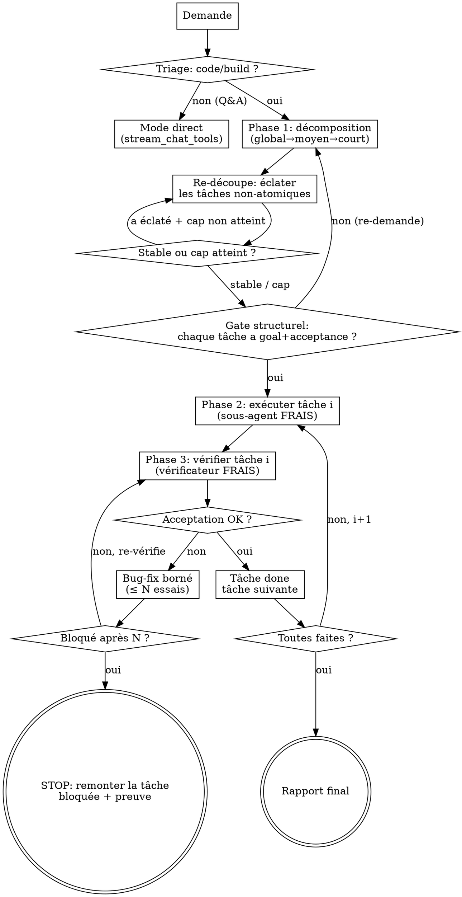

# Harnais de réflexion (découpage forcé) — Design

> Spec Loom. Transpose la méthodologie superpowers (brainstorm → plan → subagent-driven)
> au modèle local 4B : un rail déterministe force la décomposition d'une demande de code
> en **tâches atomiques**, exécute chacune en **contexte frais**, et **vérifie** chacune
> avant d'avancer. But : empêcher les erreurs de se composer pour pousser le taux d'échec
> vers ~0.

## Problème

Constat live (cf. mémoires `loom-run-reel-playlist`, `loom-choix-modele`) : aucun petit
modèle (Gemma E4B, Qwen3.5-4B) ne sait construire un démineur ni débugger correctement
**d'un seul tenant**. En revanche ils réussissent une tâche **petite et bien cadrée**. Le
mode d'échec dominant n'est pas l'incapacité mais :

1. la perte du fil sur une tâche multi-étapes (contexte qui se pollue) ;
2. les erreurs qui **se composent** — on construit l'étape N+1 sur une étape N cassée ;
3. l'absence de preuve : le modèle affirme « ça marche » sans vérifier.

Loom a déjà les outils (`dispatch_agent`, `manage_todos`, `format_code`, `check_page`,
`run_shell`) et les garde-fous de boucle (`stream_chat_tools`). Ce qui manque, c'est le
**harnais qui force le découpage et la vérification** — la partie « réflexion » que
superpowers encode en gates, pas en prose.

## Principe directeur : déterminisme du PROCESS, jamais du CONTENU

Frontière non négociable (cf. mémoires `loom-lecon-harness-deterministe`,
`loom-philosophie-auto-amelioration`, `loom-reset-tooling-pur`) :

- **Le code (le rail) décide la SÉQUENCE et l'ISOLATION** : forcer une décomposition avant
  tout code, exécuter chaque tâche en contexte frais, exiger une preuve avant d'avancer,
  borner les reprises, stopper proprement sur blocage.
- **Le modèle décide tout le CONTENU** : la reformulation, les morceaux, les tâches, les
  critères d'acceptation, le code, le fix, et le verdict succès/échec (ancré dans une
  sortie réelle).

L'orchestrateur ne décide JAMAIS ce qu'est une tâche ni si un code est « bon » : il lance
la preuve déclarée et enforce l'enchaînement. C'est le déterminisme-qui-VÉRIFIE (autorisé),
pas le déterminisme-qui-DÉCIDE (proscrit).

## Architecture

Nouveau module `loom/reflect.py` exposant un orchestrateur générateur :

```
run_reflective(client, messages, system_prompt, *, registry_factory, conversation,
               model, max_tokens, permission, ...) -> Iterator[(kind, payload)]
```

Il **yield les mêmes tuples d'events** que `stream_chat_tools`
(`reasoning|content|tool_call|tool_result|tool_stream|tool_request`), plus des events de
phase (`phase`, voir plus bas). La web app le streame **à l'identique** : aucune nouvelle
plomberie de transport. Chaque sous-agent est affiché dans sa pastille comme
`dispatch_agent` aujourd'hui.

Le rail **réutilise** sans les modifier :
- `dispatch_agent` (mécanisme de sous-boucle à contexte frais) pour l'exécution et la
  vérification par tâche ;
- la `Conversation` de la session pour stocker le plan structuré (nouveau champ
  `conversation.plan`, persisté dans session.json comme `todos`) ;
- les outils communs/agnostiques (zéro changement, zéro outil par-modèle).

### Le plan structuré

Le plan est une liste de tâches, plus riche que `manage_todos` (qui reste l'outil de
bloc-notes du mode direct, inchangé) :

```python
@dataclass
class Task:
    id: int                 # ordre stable
    goal: str               # objectif atomique (UNE chose)
    files: list[str]        # fichiers que la tâche touche (contexte du sous-agent)
    acceptance: str         # critère CONCRET et EXÉCUTABLE de "fini"
    status: str             # pending | in_progress | done | blocked
    evidence: str = ""      # sortie réelle de la dernière vérification
```

`acceptance` doit être une **preuve runnable** : une commande `run_shell`, une assertion
`check_page` (« 0 erreur console, 81 cellules »), `py_compiles`, ou un observable précis et
vérifiable. Une acceptation vague (« le code est propre ») est refusée au gate.

### Le flux : triage → décompose → (re-découpe)* → (exécute → vérifie → fixe)\*



## Phase 0 — Triage (routage, pas décision de contenu)

Le mode réflexion est **toujours actif pour le code** : à l'entrée, un tour de
classification léger décide la VOIE (pas le contenu). Le modèle répond à une consigne
binaire : la demande exige-t-elle de **créer/modifier du code ou un travail multi-étapes**,
ou est-ce une **demande directe** (résumé, lecture, recherche, réponse) ?

- Direct → on délègue à `stream_chat_tools` (mode actuel) inchangé.
- Build/multi-étapes → on entre dans le rail.

Le triage ROUTE ; il ne décide pas QUOI faire. Pour rester robuste, le défaut en cas
d'ambiguïté est **le rail** (mieux vaut sur-découper une tâche moyenne que de bâcler un
build). Le triage est un seul tour, peu coûteux.

## Phase 1 — Décomposition en entonnoir

Pilotée par un prompt dédié (`loom/prompts/reflect.decompose.md`). Le modèle produit, du
global vers le minuscule :

1. **global** : reformule l'objectif en 1-2 phrases + liste les gros morceaux.
2. **moyen** : casse chaque morceau en sous-étapes.
3. **court** : casse les sous-étapes en **tâches atomiques** — une tâche = UNE chose
   (une fonction, un fix, une section), avec un `acceptance` concret et exécutable.

Sortie : le plan structuré (liste de `Task`). Le modèle l'émet via un appel d'outil dédié
au rail (`submit_plan`, voir « Outils internes ») pour qu'on récupère du JSON validé plutôt
que du texte à parser.

### Re-découpage en boucle jusqu'à stabilité (le levier « plein de petites tâches »)

Après la 1re décomposition, on lance une **passe de re-découpage** : un sous-agent frais
dont le SEUL job est « parcours ce plan et éclate toute tâche non-atomique en plusieurs
tâches plus petites ; laisse intactes celles déjà atomiques ». On répète tant qu'une passe
**a effectivement éclaté** au moins une tâche.

Garde-fous (pas de fragmentation infinie ni de runaway) :
- **cap de passes** : `max_split_passes` (défaut 4) ;
- **cap de tâches** : `max_tasks` (défaut 30, aligné sur `manage_todos`) ; au-delà, on
  arrête de découper.
- Quand un cap est atteint alors qu'une passe voulait encore éclater, on **émet un `log`**
  visible (« re-découpage stoppé au cap de N passes / M tâches ») — jamais de cap
  silencieux qui ferait croire à une atomicité atteinte.

### Gate structurel (dur)

On ne passe à l'exécution que si le plan vérifie, de façon déterministe :
- ≥ 1 tâche ;
- chaque tâche a un `goal` non vide ;
- chaque tâche a une `acceptance` non vide ET qui ressemble à une preuve exécutable
  (heuristique simple : contient une commande, un nom de fichier, un nombre attendu, ou un
  mot-clé d'outil `run_shell`/`check_page`/`pytest`/`compile` — sinon on redemande au
  modèle de rendre l'acceptation vérifiable).

Échec du gate → on renvoie au modèle un message actionnable (« tâche k sans critère
vérifiable : donne une commande/observable ») et on reprend la décomposition (borné par
`max_decompose_retries`, défaut 2).

## Phase 2 — Exécution tâche par tâche, contexte FRAIS

Le rail parcourt les tâches dans l'ordre `id`. Pour la tâche courante :
- statut `in_progress` ;
- on dispatche un **sous-agent neuf** (sous-boucle `stream_chat_tools` via le mécanisme de
  `dispatch_agent`, contexte vierge) avec un prompt **autonome** assemblé par le rail :
  - l'objectif de CETTE tâche uniquement ;
  - les `files` concernés (chemins absolus) ;
  - le critère `acceptance` ;
  - la consigne dure « fais SEULEMENT cette tâche ; écris le code, `format_code`, puis
    lance ton critère d'acceptation ; ne touche à rien d'autre ».

Le contexte frais est le cœur du remède au mode d'échec n°1 (pollution du contexte) : le
sous-agent ne voit ni les autres tâches ni l'historique, juste son micro-objectif.

## Phase 3 — Vérification + bug-fix par tâche (regard neuf)

Après l'exécution, un **vérificateur frais et séparé** (autre sous-agent) reçoit le critère
`acceptance` et la consigne « lance CETTE preuve et rapporte le verdict + la sortie réelle ;
tu n'as pas écrit ce code, ne le juge pas de confiance ». Il renvoie un verdict structuré
(`{ok: bool, evidence: str}`) via un outil interne (`report_verdict`).

- `ok` → tâche `done`, `evidence` stockée, tâche suivante.
- `not ok` → **boucle de fix bornée** (`max_fix_attempts`, défaut 3) : un sous-agent de fix
  reçoit l'objectif + l'`evidence` d'échec (sortie réelle) + les fichiers, corrige, puis on
  **re-vérifie** (nouveau vérificateur frais). 
- Toujours `not ok` après `max_fix_attempts` → tâche `blocked`, **on STOPPE le rail** et on
  remonte à l'utilisateur : quelle tâche, son objectif, et la dernière `evidence`. On
  n'avance JAMAIS sur une tâche cassée.

C'est l'invariant central : chaque tâche est un **checkpoint vérifié**. Les erreurs restent
locales au lieu de se composer → c'est ce qui pousse le taux d'échec global vers ~0.

## Outils internes au rail (non exposés dans l'UI)

Trois `ToolSpec` éphémères, montés uniquement dans les registres internes du rail (pas dans
`AVAILABLE_TOOLS`, pas cochables, agnostiques au modèle) :

- `submit_plan(tasks)` : le modèle rend le plan structuré (schéma `Task` sans `status`).
  Validé par le gate structurel.
- `report_verdict(ok, evidence)` : le vérificateur rend son verdict ancré dans la sortie
  réelle.

Ils servent uniquement à récupérer du **JSON validé** au lieu de parser du texte libre d'un
4B (fiabilité). Ils ne donnent aucune capacité d'action — juste un canal de retour typé.

## Events de phase (UI)

Le rail émet, en plus des events existants, un event `phase` :
`("phase", {"name": "décomposition"|"re-découpage"|"exécution"|"vérification"|"fix",
            "task": <id|null>, "detail": "<libellé>"})`.

L'UI l'affiche comme un séparateur de section au-dessus du flux (réutilise le rendu des
pastilles ; pas de nouveau composant lourd). Si l'UI ne connaît pas encore `phase`, elle
l'ignore (dégradation gracieuse) — donc l'évolution UI est non bloquante.

## Garde-fous et bornes (toutes loggées, jamais silencieuses)

| Borne | Défaut | Rôle |
|---|---|---|
| `max_split_passes` | 4 | anti sur-fragmentation du re-découpage |
| `max_tasks` | 30 | plafond du plan (aligné `manage_todos`) |
| `max_decompose_retries` | 2 | reprises si le gate structurel échoue |
| `max_fix_attempts` | 3 | essais de fix par tâche avant `blocked` |
| `max_seconds` (global) | hérité | mur de temps de bout en bout |

Chaque sous-agent hérite des garde-fous existants de `stream_chat_tools` (max_iters, mur de
temps, non-progrès, audit anti-confabulation) et de la **même politique de permission**
(deny-list dure). Le rail ne contourne aucun garde-fou ; il en ajoute au-dessus.

## Ce qui N'EST PAS dans ce périmètre (YAGNI)

- Pas de parallélisme entre tâches : exécution **séquentielle** (les tâches d'un même build
  ont des dépendances ; le séquentiel + checkpoint est l'invariant anti-composition).
- Pas de reprise/persistance d'un rail interrompu à mi-parcours (le plan est persisté, mais
  reprendre une exécution partielle est un chantier ultérieur).
- Pas de nouveaux outils utilisateur ni de profils par-modèle (les outils restent communs).
- Pas de tests automatisés (cf. mémoire `loom-pas-de-tests`) : vérif par smoke/live.

## Critères de réussite

1. Sur une demande de build (mini-jeu HTML, script Python), le rail produit un plan d'au
   moins plusieurs tâches atomiques, chacune avec une acceptation exécutable.
2. Chaque tâche n'est marquée `done` qu'après une preuve réelle (sortie `run_shell` /
   `check_page`), visible dans le flux.
3. Sur une tâche qui casse, le rail tente le fix borné puis STOPPE en remontant la preuve —
   il n'enchaîne pas sur une base cassée.
4. Une demande pure Q&A (résume ce PDF) part en mode direct, sans payer le découpage.
5. Zéro changement aux outils communs ; zéro régression du mode direct.
